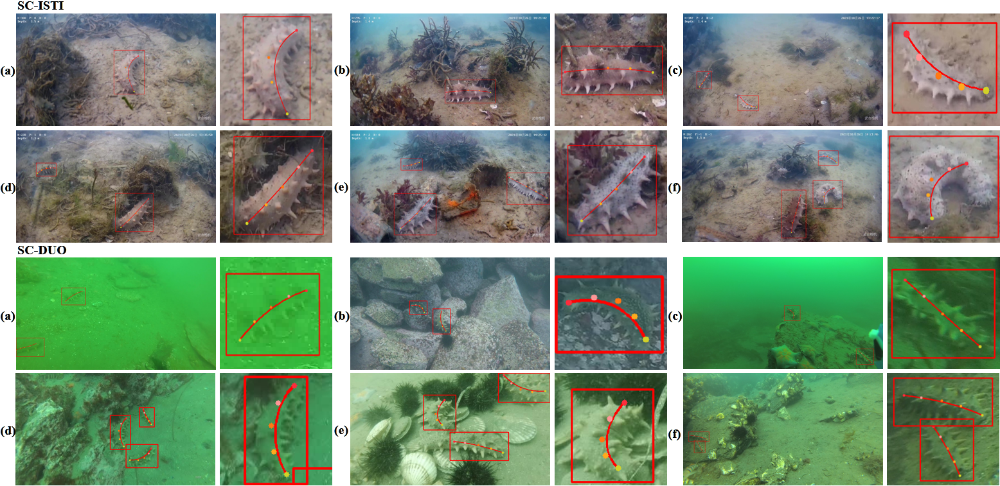

# TISC-Net: Towards the in-situ Trunk Identification and Length Measurement of Sea Cucumbers via Bezier Curve Modelling
- 🔭 I’m currently working on something cool.
<p align="center">
  
  <br>
  <em>Dynamic visualization of in-situ sea cucumber trunk identification during sea trial.</em>
</p>

<p align="center">
  
  <br>
  <em>Bezier curve fitting demonstration for sea cucumber trunk modelling.</em>
</p>

<table>
    <tr>
        <td><center>
            
Examples of trunk identification with the proposed TISC-Net. Outcomes of TISC-Net-m are presented. Each image is followed by the enlarged slice of the target, with B´ezier curve control points marked by solid circles. The images have been slightly resized for alignment.
          </center></td>
</tr>
</table>


## Installation
You  need to install [Ultralytics](https://ultralytics.com) and configure your environment according to [YOLOv8's](https://github.com/ultralytics/ultralytics) official procedures.
<summary>Install</summary>

Pip install the ultralytics package including all [requirements](https://github.com/ultralytics/ultralytics/blob/main/requirements.txt) in a [**Python>=3.8**](https://www.python.org/) environment with [**PyTorch>=1.8**](https://pytorch.org/get-started/locally/).

```bash
pip install ultralytics
```
</details>


## Models
Name | Params(M) | download DUO|  download ISTI
--- |:---:|:---|:---
[TISC-Net-m](ultralytics/models/v8/yolov8-pose-FEE.yaml) |  26.4 | [DUO_model](https://drive.google.com/file/d/1K8HDbHgeD98XpsFZKsA1NBp5WY2Jvrtl/view?usp=drive_link)| [ISTI_model](https://drive.google.com/file/d/1Kj9HsaLtjs8cBhNc6r1CUT5dPaNoM59-/view?usp=drive_link)
[TISC-Net-xP6](ultralytics/models/v8/yolov8-pose-p6-FEE.yaml) | 99.3 | [DUO_model](https://drive.google.com/file/d/1Ix_CiNNQ2wvUJLEOfkmYH2x_iJDPmuhM/view?usp=drive_link)| [ISTI_model](https://drive.google.com/file/d/1vUCLUFPxsJrsxn-t4rqXYZT_V3cq35JF/view?usp=drive_link)

## Dataset preparation 
1. You need to prepare datasets for following training and testing activities. [Datasets](https://drive.google.com/drive/folders/1Vu5FXJCceBJgjQ-BlbtqkqlKP38wqlcb?usp=drive_link)
2. The SC-ISTI dataset comprises 462 RGB images captured by an underwater robot in real habitat of sea cucumbers, with 670 sea cucumbers.
3. The SC-DUO dataset consists of 1, 023 images containing 1, 856 sea cucumbers, which is created by selecting images containing sea cucumbers from [DUO dataset](https://arxiv.org/abs/2106.05681).
## Quick Start

### Inference with Pre-trained Models

1. Pick a model and its config file, for example, `yolov8-pose-FEE.yaml`.
2. Download the model [m_DUO.pt](https://drive.google.com/file/d/1K8HDbHgeD98XpsFZKsA1NBp5WY2Jvrtl/view?usp=drive_link)
3. Run the "test.py".
```
    model = YOLO('/data/m_DUO.pt')
    img_path = 'fig/2258.jpg'
```
4. You need to replace the address of the model and images.

### Train Your Own Models

To train a model with "train.py", first prepare the custom dataset and set up the corresponding dataset yaml file
[sc_DUO-pose.yaml](https://drive.google.com/file/d/1hxbZo2EI-U9tuZY51GjuxIqiRXVOaVRJ/view?usp=drive_link),
then run "train.py":

```
from ultralytics import YOLO

# Load a model
model = YOLO('yolov8m-pose-FEE.yaml')  # build a new model from YAML


# Train the model
model.train(data='sc_DUO-pose.yaml', epochs=100, imgsz=640, device = 3, batch = 32 )
metrics = model.val()  # evaluate model performance on the validation set
metrics.box.map    # map50-95
metrics.box.map50  # map50
metrics.box.map75  # map75
metrics.box.maps   # a list con

```
---

## 📖 Citation

If you find our work useful, please consider citing:

```
@article{LIU2025110944,
title = {Towards the in-situ trunk identification and length measurement of sea cucumbers via Bézier curve modelling},
journal = {Computers and Electronics in Agriculture},
volume = {239},
pages = {110944},
year = {2025},
issn = {0168-1699},
author = {Shuaixin Liu and Kunqian Li and Yilin Ding and Kuangwei Xu and Qianli Jiang and Q.M. Jonathan Wu and Dalei Song}
}
```


